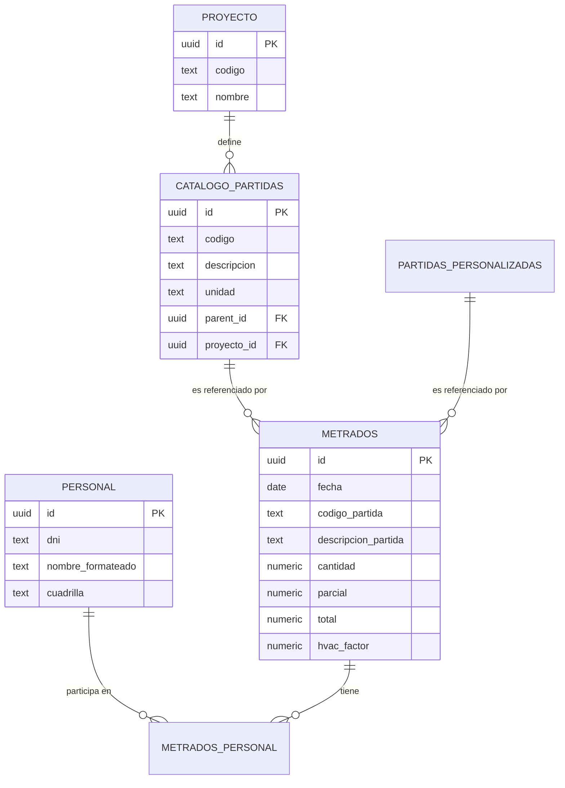

# Guía Maestra: Arquitectura SQL (Supabase/PostgreSQL)

Esta guía documenta la estructura completa de la base de datos del **Buscador de Metrados**, diseñada para ser escalable, veloz y resiliente a cambios en los catálogos maestros.

---

## Parte 1: Diagrama de Entidad-Relación (ER)

Visualización de cómo se conectan los datos entre el presupuesto, la ejecución y el personal.



---

## Parte 2: Estructura y Organización (Catálogos)

### 2.1 Tipificado de Datos Críticos
- **`NUMERIC` vs `FLOAT/REAL`**: En ingeniería, usamos `NUMERIC` para `cantidad`, `parcial` y `total`. Esto evita errores de redondeo de punto flotante que podrían causar discrepancias de céntimos en presupuestos de millones.
- **`TEXT[]` (Jerarquía)**: El uso de arrays de texto permite búsquedas "ancestrales" instantáneas sin necesidad de múltiples JOINs recursivos (CTE).

---

## Parte 3: El Núcleo de Transacción (Metrados)

### 3.1 Denormalización Estratégica
Guardamos el `codigo_partida` y `descripcion_partida` **como texto** dentro de la tabla `metrados`. 
- **Razón**: Si en 2 años se borra una partida del catálogo, el registro de producción histórica debe seguir siendo legible y auditable.

---

## Parte 4: Gestión de Cuadrillas (Estructura Híbrida)

- **Tabla `metrados_personal`**: Es una tabla "bridge" que resuelve la relación N:N. Permite que un metrado de vaciado de concreto (que requiere 10 personas) guarde a cada integrante individualmente para reportes de HH (Horas Hombre).

---

## Parte 5: Consultas Avanzadas para el Futuro

### 5.1 Reporte de Productividad por Cuadrilla
Si a futuro quieres ver cuánto ha avanzado una cuadrilla:
```sql
SELECT 
    m.cuadrilla,
    SUM(m.total) as metrado_total,
    COUNT(DISTINCT m.id) as nro_registros
FROM metrados m
WHERE m.fecha BETWEEN '2026-03-01' AND '2026-03-31'
GROUP BY m.cuadrilla;
```

### 5.2 Consultar Metrado con Nombres de Obreros
```sql
SELECT 
    m.*, 
    string_agg(p.nombre_formateado, ' / ') as obreros
FROM metrados m
JOIN metrados_personal mp ON m.id = mp.metrado_id
JOIN personal p ON mp.personal_id = p.id
GROUP BY m.id;
```

---

## Parte 7: Integridad y Mantenimiento Avanzado

### 7.1 Restricciones de Integridad (XOR)
Para evitar errores en el registro, la base de datos tiene una restricción que impide que un metrado sea simultáneamente de una partida del catálogo Y de una partida personalizada. Solo una puede ser `NOT NULL`.

### 7.2 Índices para Analytics
Si planeas crear dashboards de PowerBI o Grafana sobre esta base de datos, aplica estos índices:
```sql
CREATE INDEX idx_metrados_fecha_frente ON metrados(fecha, frente);
CREATE INDEX idx_metrados_autor ON metrados(autor_usuario);
```

### 7.3 Script de Limpieza y Recálculo
En caso de que se detecten errores manuales en los totales, este script fuerza el recálculo (simplificado):
```sql
UPDATE metrados 
SET total = parcial * nro_veces 
WHERE total IS NULL OR total = 0;
```

---
> [!IMPORTANT]
> Esta estructura garantiza que la exportación a Excel (Columna Z) sea siempre consistente con lo guardado en la nube.
