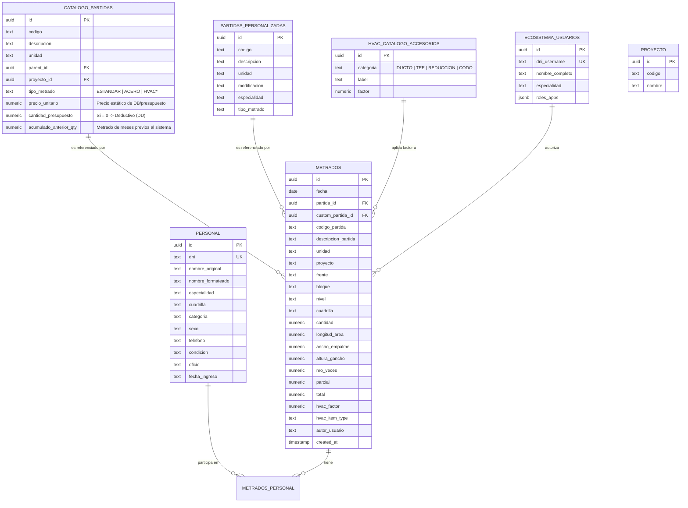

# Guía Maestra: Arquitectura SQL (Supabase/PostgreSQL)

Esta guía documenta la estructura completa de la base de datos del **Buscador de Metrados**, diseñada para ser escalable, veloz y resiliente a cambios en los catálogos maestros.

---

## Parte 1: Diagrama de Entidad-Relación (ER)

Visualización de cómo se conectan los datos entre el presupuesto, la ejecución y el personal.



---

## Parte 2: Estructura y Organización (Catálogos)

### 2.1 Tipificado de Datos Críticos

- **`NUMERIC` vs `FLOAT/REAL`**: En ingeniería, usamos `NUMERIC` para `cantidad`, `parcial` y `total`. Esto evita errores de redondeo de punto flotante que podrían causar discrepancias de céntimos en presupuestos de millones. Lo mismo aplica para cantidades presupuestadas (`cantidad_presupuesto`) y precios (`precio_unitario`).
- **`TEXT[]` (Jerarquía)**: El uso de arrays de texto permite búsquedas "ancestrales" instantáneas sin necesidad de múltiples JOINs recursivos (CTE).

### 2.2 Gestión de Precios y Deductivos (Partidas DD)

Para la integración con el Control de Costos y presupuestos originales:
- **`precio_unitario`**: Se obtiene del software base (S10, Excel) y es inyectado directo al Catálogo.
- **`cantidad_presupuesto`**: Representa el metrado original.
- **Deductivos (DD)**: Cualquier partida importada con valor de `cantidad_presupuesto` igual a `0` es considerada visual/físicamente un Deductivo y es marcado dinámicamente ("DD") en toda la Interfaz de Usuario para diferenciarse.

---

## Parte 3: El Núcleo de Transacción (Metrados)

### 3.1 Denormalización Estratégica

Guardamos el `codigo_partida` y `descripcion_partida` **como texto** dentro de la tabla `metrados`.

- **Razón**: Si en 2 años se borra una partida del catálogo, el registro de producción histórica debe seguir siendo legible y auditable.

---

## Parte 4: Gestión de Cuadrillas (Estructura Híbrida)

- **Tabla `metrados_personal`**: Es una tabla "bridge" que resuelve la relación N:N. Permite que un metrado de vaciado de concreto (que requiere 10 personas) guarde a cada integrante individualmente para reportes de HH (Horas Hombre).

---

## Parte 5: Consultas Avanzadas para el Futuro

### 5.1 Reporte de Productividad por Cuadrilla

Si a futuro quieres ver cuánto ha avanzado una cuadrilla:

```sql
SELECT 
    m.cuadrilla,
    SUM(m.total) as metrado_total,
    COUNT(DISTINCT m.id) as nro_registros
FROM metrados m
WHERE m.fecha BETWEEN '2026-03-01' AND '2026-03-31'
GROUP BY m.cuadrilla;
```

### 5.2 Consultar Metrado con Nombres de Obreros

```sql
SELECT 
    m.*, 
    string_agg(p.nombre_formateado, ' / ') as obreros
FROM metrados m
JOIN metrados_personal mp ON m.id = mp.metrado_id
JOIN personal p ON mp.personal_id = p.id
GROUP BY m.id;
```

---

## Parte 7: Integridad y Mantenimiento Avanzado

### 7.1 Restricciones de Integridad (XOR)

Para evitar errores en el registro, la base de datos tiene una restricción que impide que un metrado sea simultáneamente de una partida del catálogo Y de una partida personalizada. Solo una puede ser `NOT NULL`.

### 7.2 Índices para Analytics

Si planeas crear dashboards de PowerBI o Grafana sobre esta base de datos, aplica estos índices:

```sql
CREATE INDEX idx_metrados_fecha_frente ON metrados(fecha, frente);
CREATE INDEX idx_metrados_autor ON metrados(autor_usuario);
```

### 7.3 Script de Limpieza y Recálculo

En caso de que se detecten errores manuales en los totales, este script fuerza el recálculo (simplificado):

```sql
UPDATE metrados 
SET total = parcial * nro_veces 
WHERE total IS NULL OR total = 0;
```

---

## Parte 8: Vistas de Análisis de Negocio (Server-Side)

### 8.1 Vista de Seguimiento Presupuestal (`vista_analisis_presupuesto`)

Para evitar procesar miles de registros en el navegador, delegamos el cálculo de valorizaciones al servidor:

- **Cáculo de Cantidades**: Suma el `acumulado_anterior_qty` (histórico manual) + `qty_sistema` (metrados reales en DB).
- **Cálculo Monetario**: Multiplica el metrado total acumulado por el `precio_unitario`.
- **Propósito**: Reportes estáticos, exportaciones pesadas y PowerBI.

```sql
SELECT 
    codigo, 
    qty_presupuestada, 
    qty_acumulada_total, 
    soles_ejecutados_total 
FROM vista_analisis_presupuesto;
```

---

---

## Parte 8: Seguridad y Ecosistema de Usuarios

### 8.1 Autenticación Centralizada (`ecosistema_usuarios`)

Utilizamos una tabla centralizada para manejar el acceso a múltiples aplicaciones (Metrados, Almacén, etc.).

- **`roles_apps` (JSONB)**: Permite definir permisos específicos por aplicación. Ej: `{"metrados": "admin"}`.
- **Filtro por Especialidad**: El campo `especialidad` en esta tabla se utiliza para bloquear la vista de metrados a solo los de la especialidad asignada al usuario, a menos que su rol sea `TODAS`.

---

---

## Parte 9: Escalabilidad y Rendimiento (Frontend / API)

### 9.1 Motor de Carga Masiva V16 (Recursive Fetching)

Supabase impone un límite de seguridad de **1,000 registros por petición** en el servidor. Para manejar proyectos de gran envergadura (como los actuales de 5,789 partidas y 2,810 metrados), el sistema implementa una **Paginación Automática Recursiva**.

- **Lógica**: El `useMetradosStore` realiza peticiones sucesivas usando `.range(from, to)` en bloques de 1,000 hasta que el servidor devuelve menos de 1,000 registros (indicando el fin de la tabla).
- **Alcance**: Aplicado a `catalogo_partidas` y `metrados`. Esto garantiza que el 100% de la base de datos sea visible siempre.

### 9.2 Resiliencia de Datos: Recuperación de Huérfanos

Debido a que los catálogos son dinámicos y pueden ser limpiados o modificados por colaboradores, el sistema de visualización (`MetradosTable.tsx`) implementa un **Algoritmo de Rescate de Huérfanos**.

- **Funcionamiento**: Si un metrado histórico referencia un `codigo_partida` que ya no existe en el catálogo maestro, el sistema crea dinámicamente una **Cabecera Virtual de Partida**.
- **Resultado**: Ningún dato se pierde de la vista del usuario, permitiendo auditar registros antiguos incluso si la estructura del presupuesto cambió drásticamente.

---

## Parte 10: Importación de Datos Iniciales y Saldos (V18)

### 10.1 Lógica de Sincronización de Acumulados

Para la puesta en marcha del sistema con un proyecto en curso, se ha implementado un proceso de inyección de "Saldos Anteriores" mediante el script `0018_import_base_data.sql`.

- **Cálculo de Precio Unitario (PU)**: Debido a discrepancias en los reportes de origen, el PU se recalcula dinámicamente como `Presupuesto Acumulado / Metrado Acumulado`.
- **Campos Afectados**:
    - `acumulado_anterior_qty`: Almacena el metrado ejecutado antes de la implementación del sistema.
    - `precio_unitario`: Define el valor base para el cálculo de valorizaciones en la `vista_analisis_presupuesto`.
- **Resiliencia de Importación**: El generador (`generate_accumulation_updates.py`) utiliza una lógica de búsqueda flexible (multicolumna y escalonada) para extraer datos de Excels con estructuras heterogéneas entre especialidades.

---

> [!IMPORTANT]
> Esta estructura garantiza que la exportación a Excel sea siempre consistente con lo guardado en el ecosistema Supabase, protegiendo la trazabilidad histórica de los 2,810+ registros actuales.

---
*Última Actualización: V18 - Marzo 2026 (Corrección de Mapeo de Saldos Iniciales)*
