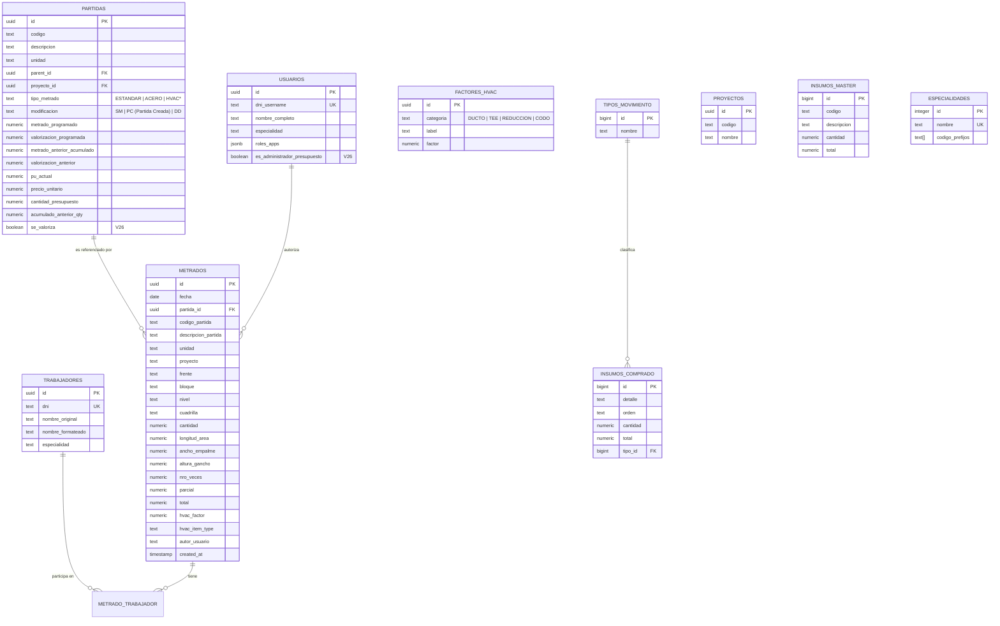

# Guía Maestra: Arquitectura SQL (Supabase/PostgreSQL)

Esta guía documenta la estructura completa de la base de datos del **Buscador de Metrados**, la cual ha sido refactorizada recientemente aplicando **DDD (Domain-Driven Design)** para ser altamente escalable, unificada y optimizada para la carga masiva en el navegador.

---

## Parte 1: Diagrama de Entidad-Relación (ER) Unificado (V28 - DDD)

Visualización de cómo se conectan los datos entre el presupuesto, la ejecución y el personal bajo la nueva arquitectura unificada.

---

## Parte 2: Arquitectura de Dominio (DDD)

### 2.1 Unificación de Entidades (V28)
Para simplificar la lógica de negocio y evitar fragmentación de datos, se ha aplicado el patrón de Dominio (DDD), renombrando y unificando tablas:
- `catalogo_partidas` y `partidas_personalizadas` ➔ **`partidas`** (Diferenciadas por la columna `modificacion = 'PC'`).
- `metrados_personal` ➔ **`metrado_trabajador`**.
- `personal` ➔ **`trabajadores`**.
- `ecosistema_usuarios` ➔ **`usuarios`**.
- `hvac_catalogo_accesorios` ➔ **`factores_hvac`**.
- La columna `custom_partida_id` en `metrados` ha sido eliminada. Todos los metrados (oficiales o custom) apuntan a la clave unificada `partida_id`.

### 2.2 Tipificado de Datos Críticos
- **`NUMERIC` vs `FLOAT/REAL`**: En ingeniería, usamos `NUMERIC` para `cantidad`, `parcial` y `total`. Evita errores de redondeo de punto flotante en presupuestos de millones.

---

## Parte 3: El Núcleo de Transacción (Metrados)

### 3.1 Denormalización Estratégica
Guardamos el `codigo_partida` y `descripcion_partida` **como texto** dentro de la tabla `metrados`.
- **Razón**: Si en 2 años se borra una partida del catálogo, el registro de producción histórica debe seguir siendo legible y auditable.

---

## Parte 4: Gestión de Cuadrillas (Estructura Híbrida)

- **Tabla `metrado_trabajador`**: Es una tabla "bridge" que resuelve la relación N:N. Permite que un metrado de vaciado de concreto (que requiere 10 personas) guarde a cada integrante individualmente para reportes de HH (Horas Hombre).

---

## Parte 5: Seguridad e Integridad

### 5.1 Llaves Foráneas Estrictas
La inserción de metrados está protegida por restricciones estandarizadas (`ON DELETE SET NULL` para llaves foráneas), asegurando que ningún metrado quede "huérfano" si se elimina una partida, pero validando estrictamente su existencia al momento del registro.

---

## Parte 6: Escalabilidad y Rendimiento Extremo (Frontend / V28)

### 6.1 Motor de Carga Masiva y Caché SWR (IndexedDB)
Descargar más de 40,000 registros simultáneamente colapsaba los motores convencionales (`localStorage`). Se ha implementado una arquitectura **Stale-While-Revalidate (SWR)** acoplada a **IndexedDB** (`idb-keyval`):

1. **Persistencia Profunda**: La totalidad de la base de datos (Catálogos y Metrados) se guarda en el disco duro interno de Chrome mediante IndexedDB.
2. **Arranque Instantáneo**: Al recargar la página, la web arranca en <0.5 segundos leyendo los 40,000 registros localmente, permitiendo filtrado masivo instantáneo.
3. **Sincronización Transparente**: En segundo plano (Background Sync), el sistema se conecta a AWS y descarga únicamente lo nuevo, actualizando la UI de forma silenciosa.

---

## Parte 7: Módulo de Administración de Presupuesto (V26)

### 7.1 Valorización Selectiva (`se_valoriza`)
- **`se_valoriza = true`** (Default): La partida contribuye al monto facturado (S/).
- **`se_valoriza = false`**: La partida se utiliza solo para control de avance físico (unidades), pero su valor monetario es ignorado en reportes de valorización.

---

## Parte 8: Auditoría y Volumetría Actualizada (Mayo 2026 - DDD)

### 8.1 Estadísticas de Producción
Tras la fusión y unificación final (Migración Fase 3):
- **Metrados Totales**: ~40,239 registros estandarizados.
- **Vínculos de Trabajadores (`metrado_trabajador`)**: ~74,326 enlaces verificados.
- **Partidas Consolidadas**: Incluye tanto Catálogo Maestro como Partidas Creadas.

---
*Última Actualización: V28 - 22 de Mayo 2026 (Refactorización DDD & Integración IndexedDB)*
