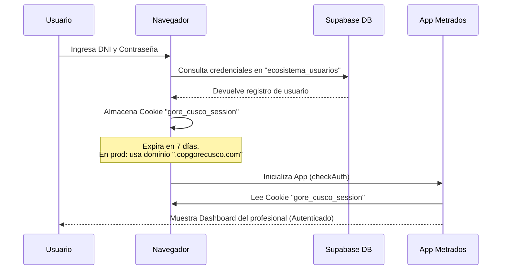
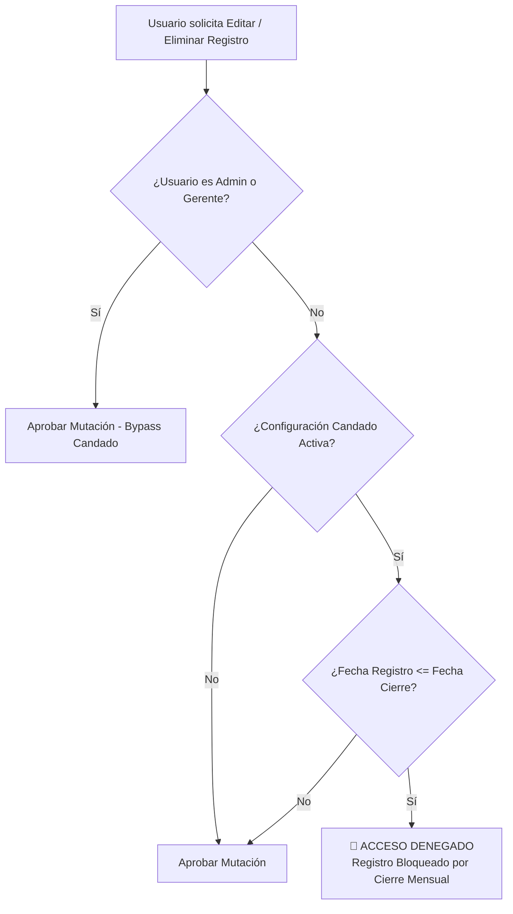

# 👤 CONTROL DE ACCESO, SSO Y SEGURIDAD

Este documento detalla el funcionamiento del sistema de autenticación, control de accesos, roles, y mecanismos de seguridad de datos del **Sistema de Gestión de Metrados (V5.0)**.

---

## 1. Autenticación Centralizada (`ecosistema_usuarios`)

El sistema utiliza una base de datos centralizada en Supabase para gestionar las credenciales de los profesionales autorizados. Esto permite que una sola cuenta acceda a múltiples aplicaciones del ecosistema (por ejemplo, Metrados, Almacén, Incidencias, etc.).

* **Credencial de Acceso:** El identificador único es el DNI del usuario (`dni_username`) y una contraseña de seguridad encriptada o controlada.
* **Información de Perfil:** Almacena datos como el Nombre Completo, Especialidad, Cargo, y Área a la que pertenece el usuario (ej. "OBRAS", "LIQUIDACIONES", "GERENCIA").

---

## 2. Single Sign-On (SSO) en Producción

Para brindar una experiencia fluida ("sin re-login diario"), el sistema implementa un mecanismo de inicio de sesión único (SSO) basado en cookies compartidas:

> [!IMPORTANT]
> **Dominio de Cookie de Sesión:**
> * En **Desarrollo (Local):** La cookie se almacena localmente y es accesible para `localhost`.
> * En **Producción (Hostinger / Nube):** La cookie se configura usando el dominio `.copgorecusco.com` en modo `sameSite: 'lax'` y con el flag `secure: true`. Esto permite que subdominios hermanos como `metrados.copgorecusco.com` e `insumos.copgorecusco.com` compartan la misma sesión del usuario sin tener que volver a loguearse.

---

## 3. Matriz de Roles y Niveles de Privilegios

La aplicación cuenta con cuatro perfiles lógicos de usuarios que determinan la interfaz a visualizar y las operaciones CRUD (`SELECT`, `INSERT`, `UPDATE`, `DELETE`) que pueden realizar:

| Perfil Lógico | Cargo / Rol Técnico | Permisos Funcionales | Enrutamiento de Datos |
| :--- | :--- | :--- | :--- |
| **Lector / Visita** | Cargo: `VISITA` o `OBSERVADOR` o rol `lector` | * **Acceso 100% de Solo Lectura.** * Visualiza todos los frentes y especialidades. * Botones de guardado, edición y borrado están ocultos o deshabilitados. | Consulta en `catalogo_partidas` y `metrados`. |
| **Metrador (Regular)** | Cargo: contiene `METRADOR` | * **Permisos de Edición Propios.** * Puede registrar metrados nuevos en su especialidad. * **Restricción de Propiedad:** Solo puede modificar o eliminar los registros que él mismo creó. | Operaciones sobre `metrados` bajo filtro de autoría. |
| **Especialista / Jefe** | Especialidad: ej. `ESTRUCTURAS` | * **Permisos de Edición Total de su Especialidad.** * Puede registrar, editar y borrar cualquier metrado que corresponda a su especialidad asignada. | Operaciones sobre `metrados`. |
| **Administrador de Presupuesto** | Campo: `es_administrador_presupuesto = true` o rol `admin_presupuesto` | * **Control Maestro de Datos.** * Accede al panel `/admin/presupuesto`. * Puede añadir, editar o recalcular partidas en el Catálogo de Partidas oficial. * Ignora bloqueos temporales de fechas. | CRUD sobre `catalogo_partidas` y `logs_maestro_presupuesto`. |
| **Gerencia / Director** | Cargo: contiene `GERENCIA` o campo `es_gerencia = true` | * **Acceso Gerencial y Dashboards.** * Visualiza dashboards ejecutivos avanzados y PowerBI integrado. * Analiza métricas económicas del avance del proyecto. | Consulta de vistas agregadas en Supabase. |

---

## 4. Seguridad y Aislamiento por Especialidad

Para evitar interferencias operativas entre diferentes frentes de ingeniería en obra (por ejemplo, que un ingeniero eléctrico modifique por error las mediciones de estructuras), la aplicación implementa un **Aislamiento Reactivo**:

1. **Detección Automática:** Al iniciar sesión, la aplicación lee la especialidad registrada del usuario en `ecosistema_usuarios`.
2. **Bloqueo de Filtros:** Si el usuario es de una especialidad específica (ej. `INSTALACIONES SANITARIAS`), el selector de especialidad en el Frontend se bloquea permanentemente en esa especialidad. El usuario no puede cambiar a otras.
3. **Liberación para Supervisores:** Si el rol de metrados del usuario es `TODAS`, `ADMIN`, o `SUPERVISOR`, el selector de especialidad se desbloquea, permitiendo navegar libremente por todas las ramas.

---

## 5. Candado de Bloqueo Temporal (Cierre Mensual)

Para proteger la integridad de las valorizaciones históricas aprobadas por la supervisión, el sistema implementa un **Candado de Bloqueo por Fecha (Lockout Candado)**:

### Reglas de Negocio del Candado:
* **Persistencia Centralizada:** La configuración del candado reside en una fila especial de `ecosistema_usuarios` con el identificador virtual `dni_username = 'SISTEMA'`.
* **Configuración Dinámica:** Contiene dos propiedades dentro del campo JSONB `roles_apps.metrados_lock`:
  * `activo` (booleano): Activa o desactiva el bloqueo temporal global.
  * `fecha_cierre` (fecha ISO YYYY-MM-DD): Fecha límite del cierre de valorización.
* **Comportamiento Funcional:** Cuando un usuario no-administrador intenta registrar, editar o eliminar un metrado cuya fecha es menor o igual a la `fecha_cierre`, la interfaz muestra un aviso de advertencia y cancela la operación de guardado en la base de datos, blindando los datos históricos contra alteraciones accidentales o fraudulentas.
